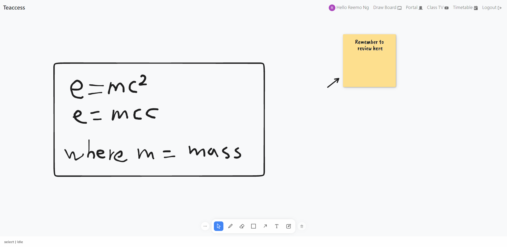
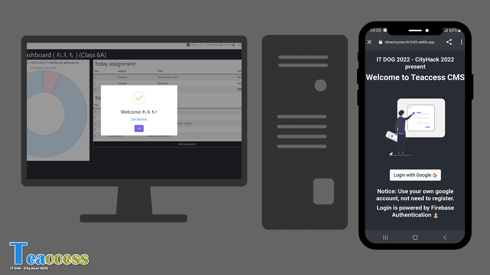

# CityHack22 Project Submission
## Project: Teaccess

## Team: IT DOG
## Members
- [reemo](https://github.com/r48n34)
- [komarcus](https://github.com/komarcus)
- [hhui0921](https://github.com/hhui0921)
- [invalidname1911](https://github.com/invalidname1911)

# Project site
https://vibrant-jones-fe1b53.netlify.app/

# Features
1. Full online class Management    

- All you works can be done in online, from starting, management, login, adjusment.   
- Easy to use, no extra function and funcy technology. Just press and use.  

2. Teaching tools for better teaching experiences (For teachers mainly)  

- Various tools to enhance the teaching quality and better experiences for student.  
- All the stuff are demanding from teacher requirement and student suggestions.  
- Integrated tools that will be use in class, from teaching tools, portal, information, porial TV, assignment and notices boxes.  
- No need to open a lot of software and remember all steps. just one platform.  

3. Web base, no need to install (PWA support)  
 

- Access everywhere, anywhere with phones.     
- No need to install in your pc, just access the internet.   
- Mobile responsive    

# Tech used
## 1. Front End
(Hours involved: 12 hrs for develop frontend protocol with login)
- React  
- Redux 
- react-router-dom-v6 
- React bootstrap (css framework)
- react-icons (All icon display)
- sweetalert2-react-content (pop alert library)
- @tldraw/core & @tldraw/tldraw (Drawing library)
- react-chartjs-2 (Graph display library)
- moment.js (Time formal library)
- react-youtube (Boardcasting month / week / morning school meeting)
- fullcalendar-react (TimeTable library) with timegrid & daygrid  

## 2. Services ( serverless base )
- Firebase Authentication with google account  

## 3. Deployment & CI/CD
- Netlify  

## 4. Design images references 
- unDraw [https://undraw.co/]
- materialui [https://materialui.co/colors/]

## 5. Others data
- Chinese name generator data come from  
香港熱門中文名字排行榜: [https://www.namechef.co/zh/popular-chinese-names/hong-kong/]  
百家姓wiki: [https://zh.wikipedia.org/wiki/%E7%99%BE%E5%AE%B6%E5%A7%93]  