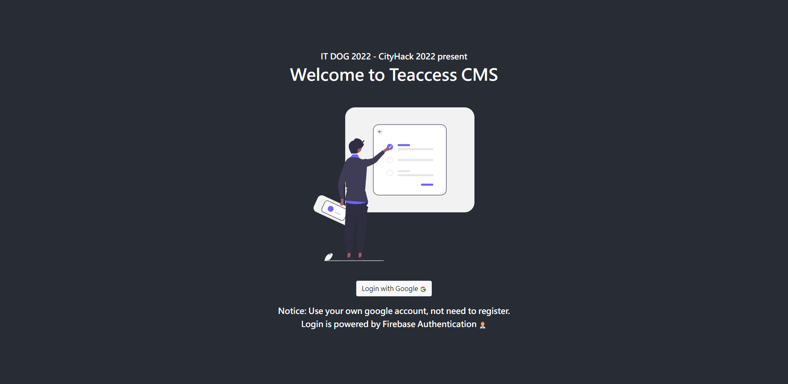

# CityHack22 Project Submission
## Project: Teaccess

## Team: IT DOG
## Members
- Ng Chun Hei (Leader)
- Hui Ka Fai 
- Ko Man Yeung 
- Lee Kam Hung 

# Project site
https://vibrant-jones-fe1b53.netlify.app/

- Login is powered by Firebase Authentication, we CAN NOT access or steal your google account.
- Any Google account can be login through the system currently

# Description of the Project (300 words)

### Aims for teacher, best for lecture.  
As we all know that various platform that can be use to manage student and teacher online services.  
Yet, some teachers reflect that the online teaching model and tons of services are making them confuse.  
Expecially the senior teacher that may not used to perform certain actions on computer or smart phone.   
    
Hence, our vision is to assist all the teacher to using a easy to access,   
easy to use and easy to learn platform for enhancing online or hybrid teaching experiences.  

### e-class / canvas / google classroom / CMS alternative?  
The project is not a alternative of those product services,   
but a extra platform for those in primary / secondary / other education institution for manage or light services for teaching.  
Out vision is to help teachers to achieve better teaching assist with the platform,   
for explain their class content and daily school informations.  

### One for all, All for one.
      tous pour un, un pour tous

# 3. Most Impactful Features of the Project
1. Full online class Management    

- All you works can be done in online, from starting, management, login, adjusment.   
- Easy to use, no extra function and funcy technology. Just press and use.  

2. Teaching tools for better teaching experiences (For teachers mainly)  

- Various tools to enhance the teaching quality and better experiences for student.  
- All the stuff are demanding from teacher requirement and student suggestions.  
- Integrated tools that will be use in class, from teaching tools, portal, information, porial TV, assignment and notices boxes.  
- No need to open a lot of software and remember all steps. just one platform.  

3. Web base, no need to install (PWA support)  
   
- Access everywhere, anywhere with phones.    
- No need to install in your pc, just access the internet.  
- Mobile responsive  

# Tech used
## 1. Front End
- React  
- Redux (Recoil is better btw)
- react-router-dom-v6 ( Yeah we are using v6 not v5 / 4)
- React bootstrap (css framework)
- react-icons (All icon display)
- sweetalert2-react-content (pop alert library)
- @tldraw/core & @tldraw/tldraw (Drawing library)
- react-chartjs-2 (Graph display library)
- moment.js (Time formal library)
- react-youtube (Boardcasting month / week / morning school meeting)
- fullcalendar-react (TimeTable library) with timegrid & daygrid

- Further development:  
Use Recoil / react query instead of Redux  
Use next.js instead of react
SEO enhancement

## 2. Services ( serverless base )
- Firebase Authentication with google account  

- Further development:   
Using Firebase firestore or dynamobd / mongodb

## 3. Deployment & CI/CD
- Netlify  

## 4. Design images references 
- unDraw [https://undraw.co/]
- materialui [https://materialui.co/colors/]

## 5. Others data
- Chinese name generator data come from  
香港熱門中文名字排行榜: [https://www.namechef.co/zh/popular-chinese-names/hong-kong/]  
百家姓wiki: [https://zh.wikipedia.org/wiki/%E7%99%BE%E5%AE%B6%E5%A7%93]  

# Link
- PPT pdf: in assets/itdogch2022ppt.pdf
- https://youtu.be/dz0ZgZrbxTs